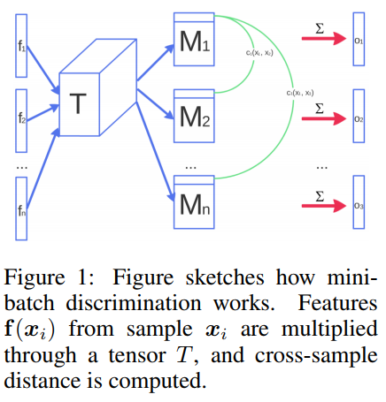

Suggested layout:

## [Generative Adversarial Networks as Variational Training of Energy Based Models](https://openreview.net/pdf?id=ry7O1ssex)
### *Shuangfei Zhai, Yu Cheng, Rogerio Feris, Zhongfei Zhang*

(One or two paragraphs describing paper and any thoughts on it)

## [Improved Techniques for Trainings GANs][improved]
### *Tim Salimans, Ian Goodfellow, Wojciech Zaremba, Vicki Cheung, Alec Radford, Xi Chen*

This paper has two parts: five recommended techniques for training GANs and
a thorough evaluation with visual Turing tests and semi-supervised tasks.
That is more concrete than the feature extraction and visualisation in, for
example, Radford's [DCGAN paper][dcgan].

The shortest description of the four techniques can be found on the
[summary for this paper][short] on shortscience. I'm just going to expand a
little on that summary, but otherwise keep it the same.

### Feature Matching

Problem: instability from overtraining on the current discriminator.
Intuition is that the discriminator will have learnt the kind of useful
representation we see in deep image models, and there is more information
available by matching those than the single classifier output.

Solution: Match activations at some hidden with an L2 loss. This is
the same as the "content" loss in the [neural style paper][style]:

$$
\newcommand{\aB}{\mathbf{a}}
\newcommand{\bB}{\mathbf{b}}
\newcommand{\cB}{\mathbf{c}}
\newcommand{\dB}{\mathbf{d}}
\newcommand{\eB}{\mathbf{e}}
\newcommand{\fB}{\mathbf{f}}
\newcommand{\gB}{\mathbf{g}}
\newcommand{\hB}{\mathbf{h}}
\newcommand{\iB}{\mathbf{i}}
\newcommand{\jB}{\mathbf{j}}
\newcommand{\kB}{\mathbf{k}}
\newcommand{\lB}{\mathbf{l}}
\newcommand{\mB}{\mathbf{m}}
\newcommand{\nB}{\mathbf{n}}
\newcommand{\oB}{\mathbf{o}}
\newcommand{\pB}{\mathbf{p}}
\newcommand{\qB}{\mathbf{q}}
\newcommand{\rB}{\mathbf{r}}
\newcommand{\sB}{\mathbf{s}}
\newcommand{\tB}{\mathbf{t}}
\newcommand{\uB}{\mathbf{u}}
\newcommand{\vB}{\mathbf{v}}
\newcommand{\wB}{\mathbf{w}}
\newcommand{\xB}{\mathbf{x}}
\newcommand{\yB}{\mathbf{y}}
\newcommand{\zB}{\mathbf{z}}
\newcommand{\Exp}{\mathbb{E}}
|| \Exp_{\xB \sim p_{\text{data}}} \fB (\xB) - \Exp_{\zB \sim p_{\zB}(\zB)} \fB (G(\zB)) ||_2^2
$$

Where $\fB (\xB)$ and $\fB (\zB)$ are the activations in some hidden layer
corresponding to either a real or generated image.

### Minibatch Discrimination

Problem: generators like to collapse to a single mode (ie just generate a
single image), because it's a decent local optimum.

Solution: make sure the discriminator can look at samples in combination,
so it will know if it's getting the same (or similar) images more easily.
Just give the discriminator features that tell it about the distance of
each image to other images in the same batch. The diagram in the paper
describes this best:

They mention this tensor $T$ in the paper, but don't really explain what it
is. In [the code][mbcode], it appears to be basically a weight matrix,
which means that it is also learnt as part of the discriminator.

### Historical Averaging

Problem: no guarantee with gradient descent that a two player game like
this won't go into extended orbits.

Solution: encourage parameters to revert to their historical mean, with an
L2 penalty:

$$
\newcommand{\thetaB}{\boldsymbol{\theta}}
|| \thetaB - \frac{1}{t} \sum_{i=1}^t \thetaB[i] ||^2
$$

Orbits are penalised by always being far from their mean, and this is
supposed to correspond to a "fictitious play" algorithm. I'm not sure if
that's true, but maybe?

### One-sided label smoothing

Problem: vulnerability of discriminator to adversarial examples? (Not
explicitly stated).

Solution: replace positive (ie probability that a sample is real?) labels
with a target _smaller than 1_.

### Virtual Batch Normalisation

Problem: batch normalisation is highly variable, as it is based on
statistics of the current minibatch (enough so that you can sometimes avoid
using dropout if you're using batchnorm).

Solution: for every minibatch, use the statistics gathered from a
_reference minibatch_ for your batch normalisation. For every minibatch,
you'll have to first propagate through the reference minibatch with your
current parameter settings, but then you can use the statistics you gather
by doing this for the minibatch you're actually going to use for training.

_Interesting sidenote_: in the [code][impcode], they are actually using
[weight normalization][weightnorm] instead of batchnorm (not in all cases).
Probably because both papers have Tim Salimans as first author.

### Assessing Image Quality

Problem: noisy labelling from mechanical turk.

Solution: aim for low entropy conditional categorical distribution when
labelling samples with Google's inception model. The inception model gives
you $p(y|\xB)$, so you want to maximise:

$$
\Exp_{\xB} KL (p(y|\xB)||p(y))
$$

Then they exponentiate the resulting value for no real reason, just to make
values easier to compare. Since they say this matches human judgement in
their experiments, this means we can all start using this measure and just
cite this paper!

### Semi-supervised Learning

Problem: standard semi-supervised, we have some data that is labelled and
some that isn't, how to learn a conditional model that will give us
$p(y|\xB)$.

Solution: make "generated" a class in your classification problem. Now you
can put generated samples into your dataset, but even better you can
produce a loss on unlabeled samples that you just _don't want them to be
labeled as "generated"_. So we end up with the following two losses for
supervised and unsupervised data:

$$
L_{\text{supervised}} = - \Exp_{\xB,y \sim p_{\text{data}} (\xB, y)} \log p_{\text{model}} (y | \xB, y < K + 1)
$$

$$
L_{\text{unsupervised}} = - \{ \Exp_{\xB \sim p_{\text{data}} (\xB)} \log [
1- p_{\text{model}} (y = K+1 | \xB) ] + \Exp_{\xB \sim G}\log [
p_{\text{model}} (y=K+1 | \xB)] \}
$$

With this method, and using feature matching but _not minibatch
discrimination_, they show SOTA results for semi-supervised learning on
MNIST, SVHN and CIFAR-10.

[mbcode]: https://github.com/openai/improved-gan/blob/master/mnist_svhn_cifar10/nn.py#L132-L170
[impcode]: https://github.com/openai/improved-gan/blob/master/mnist_svhn_cifar10/nn.py#L45-L91
[weightnorm]: https://arxiv.org/abs/1602.07868
[short]: http://www.shortscience.org/paper?bibtexKey=journals/corr/SalimansGZCRC16#udibr
[improved]: https://arxiv.org/abs/1606.03498
[dcgan]: https://arxiv.org/abs/1511.06434
[style]: https://arxiv.org/abs/1508.06576

## Disentangling factors of variation in deep representations using adversarial training 
### Michael Mathieu, Junbo Zhao, Pablo Sprechmann, Aditya Ramesh and Yann LeCun
ning a [VAE][] you will have an inference network $q(z|x)$. If you have
another source of information you'd like to base the approximate posterior
on, like some labels $s$, then you would make $q(z|x,s)$. But $q$ is a
complicated function, and it can ignore $s$ if it wants, and still perform
well. This paper describes an adversarial way to force $q$ to use $s$.

This is made more complicated in the paper, because $s$ is not necessarily
a label, and in fact _is real and continuous_ (because it's easier to
backprop in that case). In fact, we're going to _learn_ the representation
of $s$, but force it to contain the label information using the training
procedure. To be clear, with $x$ as our input (image or whatever):

$$
s  = f_{s}(x)
$$

$$
\mu, \sigma = f_{z}(x,s)
$$

We sample $z$ using $\mu$ and $\sigma$ [according to the reparameterization
trick, as this is a VAE][vae]:

$$
z \sim \mathcal{N}(\mu, \sigma)
$$

And then we use our decoder to turn these latent variables into images:

$$
\tilde{x} = \text{Dec}(z,s)
$$

Training Procedure
--------------------------

We are going to create four parallel loss functions, and incorporate a
discriminator to train this:

1. Reconstruction loss plus variational regularizer; propagate a $x_1$
through the VAE to get $s_1$, $z_1$ (latent) and $\tilde{x}_{1}$.
2. Reconstruction loss with a different $s$:
    1. Propagate $x_1'$, a different sample with the __same class__ as
 $x_1$
    2. Pass $z_1$ and $s_1'$ to your decoder.
    3. As $s_1'$ _should_ include the label information, you should have
reproduced $x_1$, so apply reconstruction loss to whatever your decoder has
given you (call it $\tilde{x}_1'$).
3. Adversarial Loss encouraging realistic examples from the same class,
regardless of $z$.
    1. Propagate $x_2$ (totally separate example) through the network to
get $s_2$.
    2. Generate two $\tilde{x}_{2}$ variables, one with the prior by
sampling from $p(z)$ and one using $z_{1}$.
    3. Get the adversary to classify these as fake versus the real sample
$x_{2}$.

This is pretty well described in Figure 1 in the paper.

Experiments show that $s$ ends up coding for the class, and $z$ codes for
other stuff, like the angle of digits or line thickness. They also try to
classify using $z$ and $s$ and show that $s$ is useful but $z$ is not (can
only predict as well as chance). So, it works.

[vae]: https://jaan.io/unreasonable-confusion/
